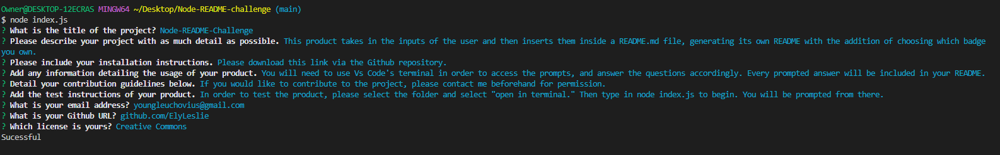

# Node-README-Challenge

## Table of Contents
* [Description](#description)
* [Installation](#installation)
* [Usage](#usage)
* [Tests](#tests)
* [License](#license)
* [Questions](#questions)
        
        
## Description: 
* This product takes in the inputs of the user and then inserts them inside a README.md file, generating its own README with the addition of choosing which badge you own.
        
        
* Contribution guidelines: If you would like to contribute to the project, please contact me beforehand for permission.

## Installation:

* Installation instructions: Please download this link via the Github repository.
        
## Usage

* Usage information: You will need to use Vs Code's terminal in order to access the prompts, and answer the questions accordingly. Every prompted answer will be included in your README.

        
## Tests:
* Test instructions: In order to test the product, please select the folder and select "open in terminal." Then type in node index.js to begin. You will be prompted from there.
        
## License: 
* Creative Commons
        
## Questions: 
        
* If you would like to contact me to address any further questions, please email me at youngleuchovius@gmail.com
* You can find my GitHub at github.com/ElyLeslie

